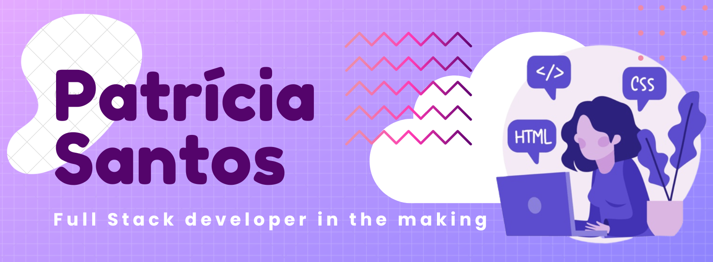

<div>
 <a href = "mailto:scunha.patricia@gmail.com"></a>
 <a href="https://www.linkedin.com/in/patr%C3%ADcia-santos-1752bb224/" target="_blank"></a> 
</div>


 
---

```javascript
const patricia = {
  pronouns: "she" | "her",
  languages: [Java, HTML, CSS, Python, Javascript, C],
  learning: [C++, React, Typescript, node.js, Sass]
   
//Always learning
}
```
---

<h3 align="left">Connect with me:</h3>
<p align="left">
<a href="https://linkedin.com/in/patricia-scunha" target="blank"></a>
</p>

<h3 align="left">Languages and Tools:</h3>
<p align="left"> <a href="https://www.cprogramming.com/" target="_blank" rel="noreferrer">  </a> <a href="https://www.w3schools.com/css/" target="_blank" rel="noreferrer">  </a> <a href="https://git-scm.com/" target="_blank" rel="noreferrer">  </a> <a href="https://www.w3.org/html/" target="_blank" rel="noreferrer">  </a> <a href="https://www.java.com" target="_blank" rel="noreferrer">  </a> <a href="https://developer.mozilla.org/en-US/docs/Web/JavaScript" target="_blank" rel="noreferrer">  </a> <a href="https://www.python.org" target="_blank" rel="noreferrer">  </a> </p>

<div>
  <a href="https://github.com/Patricia-Santos">
  
  
</div>
